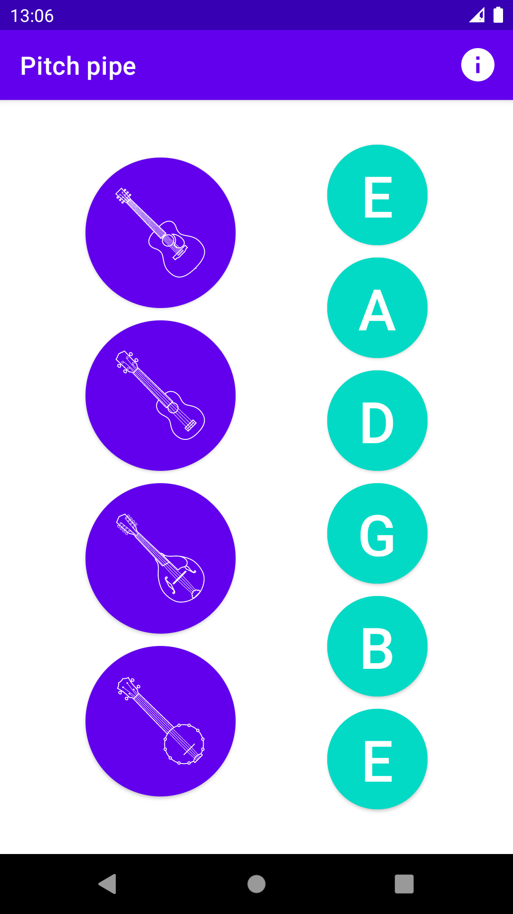

---

Simple instrument [pitch pipe](https://en.m.wikipedia.org/wiki/Pitch_pipe) for Android

Built using:

- [KyoSherlock/MidiDriver](https://github.com/bmaupin/MidiDriver)
- [kshoji/javax.sound.midi-for-Android](https://github.com/kshoji/javax.sound.midi-for-Android)
